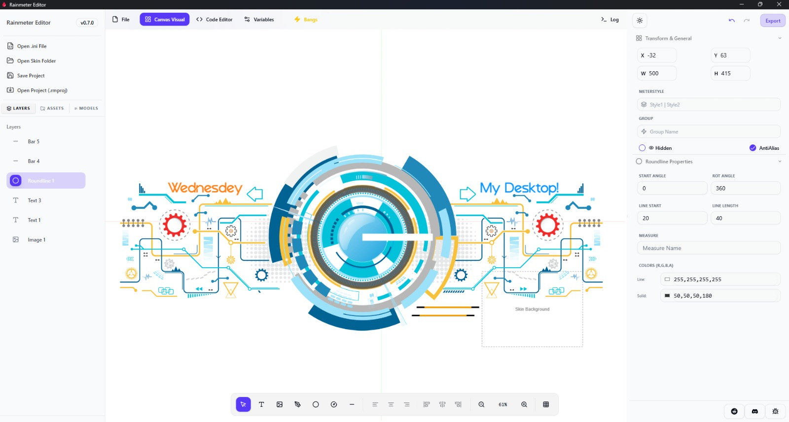

# Rainmeter Editor

[](LICENSE)
[](https://github.com/kethakav/rainmeter-editor/releases)

A modern, open-source GUI editor for [Rainmeter](https://www.rainmeter.net/) skins. Design, preview, and export Rainmeter skins visually—no INI editing required!

> **Note:** Rainmeter Editor and Rainmeter itself are **Windows-only**. This app will not run on macOS or Linux.


## Features

- **Bidirectional Visual Editor:** Seamless real-time synchronization between the visual canvas and INI code. Switch between tabs without losing data or losing alignment.
- **Advanced Meter Support:** Support for complex Rainmeter elements including:
  - **Shapes:** Create and edit Rectangles and Ellipses with stroke and fill controls.
  - **Roundlines:** Visual editing of meters that display circular progress or status.
  - **Bars:** Enhanced bar meters with background and foreground layer management.
  - **Rotators & Images:** Full support for image-based meters.
- **Visual Property Editing:** Specialized sidebars for every meter type, featuring visual color pickers with automatic conversion to Rainmeter's `R,G,B,A` format.
- **Layer Management:** Precise control over layer order (Z-index), visibility, and selection.
- **Session Asset Caching:** Smart handling of local images ensures that absolute paths are preserved during your session for a true WYSIWYG experience.
- **Font & Image Bundling:** Use local fonts and images; the editor automatically organizes them into the `@Resources` folder on export.
- **Rainmeter Export:** One-click generation of fully-compatible `.ini` skins with correct folder structures.
- **Native Windows Desktop App:** Built with Tauri for a lightweight, fast, and secure experience.


## Screenshots & Videos

#### YouTube Tutorial (Click on the image)
[](https://youtu.be/FxBZCdO-a5o)  
#### Screenshots



## Quick Start (Development)

1. **Install Prerequisites:**
   - [Node.js](https://nodejs.org/)
   - [Rust](https://www.rust-lang.org/tools/install)
   - [npm](https://www.npmjs.com/) or [pnpm](https://pnpm.io/)

2. **Clone the Repository:**
   ```sh
   git clone https://github.com/skavazza/rmeter-editor.git
   cd rmeter-editor
   ```

3. **Install Dependencies:**
   ```sh
   npm install
   # or
   pnpm install
   ```

4. **Run the App:**
   ```sh
   npm run tauri dev
   ```
   The app will open in a native window. You can now start designing Rainmeter skins!


## Download and Install (Windows)

To get the latest version of Rainmeter Editor, visit the [official website](https://rainmetereditor.pages.dev/) and download the Windows setup file.

Alternatively, you can also find releases on the [GitHub Releases](https://github.com/skavazza/rmeter-editor/releases) page.


## Usage

- Use the toolbar to add text, images, bars, shapes, roundlines and rotators to your canvas.
- Arrange and configure layers using the sidebars.
- Export your skin via the Export button; the app will generate a Rainmeter-compatible folder with all assets and an `.ini` file.
- Import/export project support is coming soon.


## Community & Support

- [Report a Bug](https://github.com/skavazza/rmeter-editor/issues/new?template=bug_report.yml)
- [Request a Feature](https://github.com/skavazza/rmeter-editor/issues/new?template=feature_request.yml)


## Contributing

See [CONTRIBUTING.md](CONTRIBUTING.md) for guidelines. All contributions, bug reports, and feature requests are welcome!


## License

MIT License (see [LICENSE](LICENSE))

## Acknowledgements

- Built with [Tauri](https://tauri.app/), [React](https://react.dev/), [Fabric.js](http://fabricjs.com/), [Radix UI](https://www.radix-ui.com/), and [Tailwind CSS](https://tailwindcss.com/).